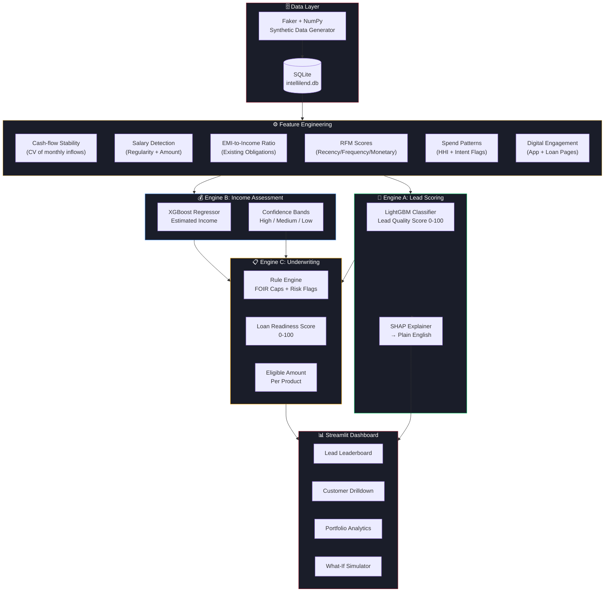

# Architecture Diagram — IDBI IntelliLend

## Current Hackathon Prototype

---

## Production-Ready Architecture (Future Roadmap)

```mermaid
flowchart LR
    subgraph Sources["Data Sources"]
        AA["Account Aggregator<br>(Consent-based)"]
        CBS["Core Banking<br>System"]
        UPI["UPI/NPCI<br>Transaction Data"]
        GST["GST Portal<br>(Self-employed)"]
        CRM["Existing CRM<br>Customer Data"]
    end

    subgraph Consent["🔒 Consent Layer"]
        CL["Customer Consent<br>Management"]
        AES["AES-256<br>Encryption"]
    end

    subgraph DataPlatform["☁️ Data Platform"]
        DL["Data Lake<br>(S3/Azure Blob)"]
        FS["Feature Store<br>(Real-time + Batch)"]
        CDC["Change Data<br>Capture"]
    end

    subgraph MLPlatform["🤖 ML Platform"]
        MS_A["Model Serving<br>Engine A"]
        MS_B["Model Serving<br>Engine B"]
        MS_C["Rules Engine<br>Engine C"]
        EXPL["Explainability<br>API"]
        MON["Model Monitoring<br>& Drift Detection"]
    end

    subgraph Integration["🔗 Integration"]
        API["REST API<br>Gateway"]
        DASH["RM Dashboard<br>(Streamlit/React)"]
        CRM_INT["CRM Integration<br>(Salesforce/Custom)"]
        NOTIF["Notification<br>Service"]
    end

    subgraph Feedback["🔄 Feedback Loop"]
        FL["Conversion<br>Outcome Tracking"]
        RT["Model<br>Retraining Pipeline"]
        AB["A/B Testing<br>Framework"]
    end

    Sources --> Consent
    Consent --> DataPlatform
    DataPlatform --> MLPlatform
    MLPlatform --> Integration
    Integration --> Feedback
    Feedback --> MLPlatform

    style Sources fill:#1a1d29,stroke:#4A9EFF,color:#fff
    style Consent fill:#1a1d29,stroke:#FF4444,color:#fff
    style DataPlatform fill:#1a1d29,stroke:#D4A843,color:#fff
    style MLPlatform fill:#1a1d29,stroke:#00D26A,color:#fff
    style Integration fill:#1a1d29,stroke:#9B1B30,color:#fff
    style Feedback fill:#1a1d29,stroke:#FFAA00,color:#fff
```

---

## Data Flow Summary

| Stage | Input | Processing | Output |
|-------|-------|------------|--------|
| Data Ingestion | Raw transactions, demographics | Synthetic generation (hackathon) / AA APIs (production) | SQLite tables |
| Feature Engineering | Raw transactions + behavioral logs | 35+ engineered features across 7 groups | Feature matrix (5000 × 48) |
| Engine A | Feature matrix | LightGBM classifier + SHAP | Lead Score (0-100) + explanation |
| Engine B | Feature matrix | XGBoost regressor + confidence bands | Estimated income + band |
| Engine C | Scores + income estimate | FOIR rules + risk flags | Readiness score + eligible amount |
| Dashboard | All pipeline outputs | Streamlit visualization | Interactive RM dashboard |
